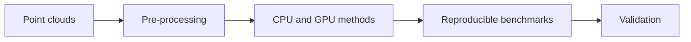

<div align="center">

# DelaunayBench: GPU Delaunay triangulation on real point clouds

[](https://www.python.org/)
[](https://developer.nvidia.com/cuda-toolkit)
[](https://www.cgal.org/)



</div>

## 📌 Description

This repository provides a reproducible framework for evaluating six published Delaunay
triangulation methods, including four GPU implementations. The benchmark covers synthetic data
as well as real LiDAR and photogrammetric point clouds, whose geometric structure can create
numerical and algorithmic challenges that do not appear on uniformly random inputs.

The study compares the implementations with a CGAL reference in terms of correctness,
performance, scalability and robustness to geometric degeneracies. Detailed experimental results
and conclusions are intentionally not included in the public repository.

Collecting the required metrics involved instrumenting some of the libraries
([`script/patch_pygdel3d.py`](script/patch_pygdel3d.py) adds three counters to gDel3D's CUDA
kernels; CGAL is built with `-DCGAL_PROFILE`), because the upstream implementations do not expose
all the measurements required by the study. A second, optional patch
([`script/patch_pygdel3d_final_flip.py`](script/patch_pygdel3d_final_flip.py)) fixes a gDel3D bug
on small inputs -- below a few dozen points it skipped its last flipping round and returned the
raw insertion result; see [`script/readme.md`](script/readme.md).

## 📁 Project structure

```
├── configs                <- One YAML per experiment
│   └── experiments        <- benchmark, jitter_sweep, scaling_tile, ...
├── data                   <- The two photogrammetric point clouds (PLY)
├── docs                   <- Public technical notes and execution guides
├── images                 <- Non-experimental illustrations
├── notebooks              <- Exploring a result JSON without recomputing it
├── script                 <- Install, build, SLURM jobs, upstream patches
├── src                    <- The benchmark driver and the three studies
├── tests                  <- Pytest tests
└── main.py                <- Entry point: python main.py experiment=<name>
```

## 💻 Environment requirements

Tested on **Ruche** (Mésocentre Paris-Saclay): NVIDIA A100-SXM4 40 GB, CUDA 12.8, 8 CPU cores,
Python 3.12, torch 2.11, CGAL 5.6.1. The scripts also run on CentraleSupélec's **DGX** (A100 with
MIG slices); [`script/readme.md`](script/readme.md) gives the partitions and the `sbatch` overrides
for it. Any CUDA GPU of compute capability 7.0+ should work — set `GPU_ARCHS=8.0` for a single
generation.

Everything except the four GPU methods runs on a CPU-only machine, and the test suite needs only
numpy.

## 🏗 Installation

```bash
git clone https://github.com/omarbesbes/DelaunayBench
cd DelaunayBench

bash script/first_install.sh     # conda env, torch, the six libraries, the compiled tools
source script/env.sh             # activate it in a new shell
```

On a cluster that provides no conda (CentraleSupélec's DGX documents a plain `venv`, which cannot
supply nvcc, GCC 13, the CGAL headers or TBB), install it once in your home directory with
`INSTALL_CONDA=1 bash script/first_install.sh`.

`first_install.sh` clones and patches the upstream libraries rather than vendoring them: three of
the six need source changes to build on this cluster or to report what we measure, and each patch
explains why at the top of its file. Expect 15–30 minutes, most of it compiling CUDA.

> **Run the installation on a login node.** Ruche's compute nodes have no route to the internet,
> so the `git clone` steps fail inside a job. `third_party/` is not tracked here — the upstream
> sources are fetched and patched rather than vendored — so a fresh clone has nothing to build
> from until this has been run once. If the environment already exists and only the compiled tools
> are missing, `bash script/build_tools.sh` on the login node is enough.

## 📦 Datasets

The two point clouds are tracked in [`data/`](data/) — about 100 000 points each, from the IARPA
and JAX photogrammetric benchmarks:

```text
data/voronoi_iarpa_001.ply     99 990 points (99 975 distinct)
data/voronoi_jax_068.ply       99 981 points (99 962 distinct)
```

Repeated points are removed during preprocessing because a Delaunay triangulation is not defined
on duplicate input points.

The full benchmark additionally samples analytic surfaces (sphere, torus, Klein bottle, trefoil)
and downloads a few standard meshes; those need no manual setup.

## 🚀 Usage

```bash
python main.py --list                              # the available experiments
python main.py experiment=jitter_sweep             # run one, exactly as recorded
python main.py experiment=jitter_sweep repeats=1   # override any setting
python main.py experiment=jitter_sweep -- --help   # the study's own options

sbatch script/run_jitter.sbatch                    # the same, as a cluster job
```

An experiment is one file in [`configs/experiments/`](configs/experiments/); its settings become
the command-line arguments of the study that runs it, so a result can be reproduced from its name
alone. The studies keep their own interfaces, so `python src/jitter_study.py --ply … --jitters …`
still works and the two paths cannot drift apart.

| experiment | what it evaluates |
|---|---|
| `benchmark` | correctness and performance on the two real point clouds |
| `benchmark_full` | the benchmark extended to analytic surfaces and standard meshes |
| `jitter_sweep` | sensitivity to different perturbation levels |
| `scaling_tile` | scalability using tiled copies of the input |
| `scaling_densify` | scalability by increasing density within the same volume |
| `report` | generation of local reports and charts from a benchmark JSON |
| `triangulate` | execution of one method on one PLY file (see below) |

### Triangulating your own cloud

```bash
python main.py experiment=triangulate method=gdel3d ply=path/to/cloud.ply
python main.py experiment=triangulate method=geodel ply=cloud.ply out=results/mine check=true
```

Writes `<out>/<cloud>_<method>/` with `points.npy`, `tets.npy` (indices into it), `mesh.vtk`
(the cells, for ParaView), `mesh.ply` (every face as a triangle mesh, for CloudCompare) and
`summary.json` (timing, preprocessing, and the difference to CGAL with `check=true`).
Duplicate points are removed and the cloud normalised into the unit cube for the method, as in
the benchmark, but the outputs are mapped back and **overlay the input PLY** in a viewer; no jitter
is added unless asked (`jitter=1e-6`). A tetrahedralization fills the convex hull, so any viewer
shows only the hull from outside: in CloudCompare load `mesh.ply` and tick *Wireframe*, or cut it
with Tools > Segmentation > Cross Section; in ParaView load `mesh.vtk` and add a *Clip*.

`geodel`, `cgal_parallel` and `cgal_sequential` run on the CPU, so the commands above work on a
login node. `paragram`, `gdel3d`, `gstar4d` and `dewall` need a GPU — on the cluster, submit them:

```bash
METHOD=gdel3d PLY=data/voronoi_jax_068.ply CHECK=true sbatch script/run_triangulate.sbatch
METHOD=gstar4d PLY=cloud.ply OUT=results/mine JITTER=1e-6 sbatch script/run_triangulate.sbatch
```

The output lands in the same place; the job log is `results/triangulate.o<jobid>`.


## 🧪 Tests

```bash
pip install -r dev_requirements.txt
pytest                      # 27 tests, no GPU and no torch needed
pre-commit run --all-files  # ruff, docformatter, prettier, large-file check
```

The tests check that every experiment config names a valid study and that each option it generates
exists in that study's `argparse` — parsed statically, so a broken config fails on a laptop in
0.3 s instead of three hours into a cluster job. `tests/test_converter.py` checks the
Voronoi-to-Delaunay conversion against Qhull and is skipped where torch is absent.

## 🚧 What is not done

- Some discrepancies between implementations require additional validation.
- Predicate instrumentation is not yet available for every method.
- Certain performance variations require more detailed profiling.
- Parts of the description of parallel strategies remain provisional and should be confirmed
  against the corresponding publications or implementation documentation.


The methods compared are [CGAL](https://www.cgal.org/),
[gDel3D](https://github.com/ashwin/gDel3D) (Cao et al., 2014),
[gStar4D](https://github.com/ashwin/gStar4D) (Nanjappa, 2012),
[Local DeWall](https://github.com/WuhengGao/Local-DeWall) (Gao & Chen, 2026),
[GeoDel](https://github.com/Anttwo/GeoDel) (Geogram, Lévy) and Paragram.
