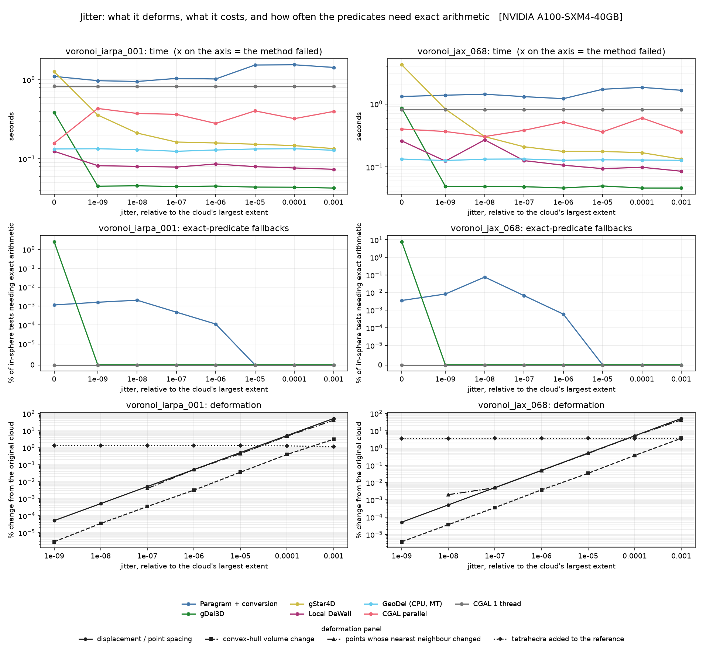
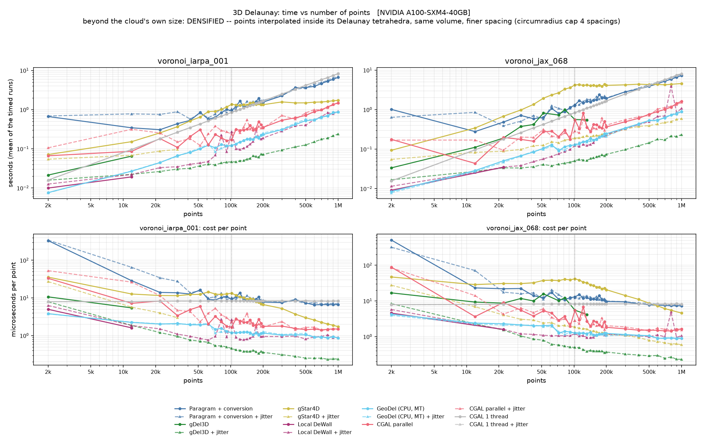

<div align="center">

# DelaunayBench: GPU Delaunay triangulation on real point clouds

[](https://www.python.org/)
[](https://developer.nvidia.com/cuda-toolkit)
[](https://www.cgal.org/)

<p align="center">
  
</p>

</div>

## 📌 Description

Six published Delaunay triangulation methods — four of them on GPU — report large speed-ups over
CGAL, measured on *uniformly random points*. Real LiDAR and photogrammetric clouds are not uniform:
they sample surfaces on a sensor grid, so large groups of points are exactly coplanar and the
Delaunay triangulation is **not unique** there. This repository measures what that costs, on two
such clouds, against an exact CGAL reference, tetrahedron for tetrahedron.

The headline result is that degeneracy, not point count, is what separates these implementations.
gDel3D is the fastest method on perturbed input (0.046 s for 100 000 points, output identical to
CGAL), but on the raw cloud **7.8 % of its in-sphere tests fall back to exact arithmetic**, which
makes it 18× slower and yields 48 889 spurious tetrahedra — while CGAL needs exact arithmetic
*zero* times on the same input. A perturbation of 1e-9, five thousandths of one percent of the
distance between neighbouring points, removes the problem entirely.

Getting that number required instrumenting the libraries ourselves
([`script/patch_pygdel3d.py`](script/patch_pygdel3d.py) adds three counters to gDel3D's CUDA
kernels; CGAL is built with `-DCGAL_PROFILE`), because none of them exposes a usable one.
Full analysis in [`docs/jitter_sweep.md`](docs/jitter_sweep.md).

## 📁 Project structure

```
├── configs                <- One YAML per experiment
│   └── experiments        <- benchmark, jitter_sweep, scaling_tile, ...
├── data                   <- The two photogrammetric point clouds (PLY)
├── docs                   <- Analyses, cluster notes, presentation
├── images                 <- Figures used in this README
├── notebooks              <- Exploring a result JSON without recomputing it
├── script                 <- Install, build, SLURM jobs, upstream patches
├── src                    <- The benchmark driver and the three studies
├── tests                  <- Pytest tests
└── main.py                <- Entry point: python main.py experiment=<name>
```

## 💻 Environment requirements

Tested on **Ruche** (Mésocentre Paris-Saclay): NVIDIA A100-SXM4 40 GB, CUDA 12.8, 8 CPU cores,
Python 3.12, torch 2.11, CGAL 5.6.1. The scripts also run on CentraleSupélec's **DGX** (A100 with
MIG slices); [`script/readme.md`](script/readme.md) gives the partitions and the `sbatch` overrides
for it. Any CUDA GPU of compute capability 7.0+ should work — set `GPU_ARCHS=8.0` for a single
generation.

Everything except the four GPU methods runs on a CPU-only machine, and the test suite needs only
numpy.

## 🏗 Installation

```bash
git clone https://github.com/omarbesbes/DelaunayBench
cd DelaunayBench

bash script/first_install.sh     # conda env, torch, the six libraries, the compiled tools
source script/env.sh             # activate it in a new shell
```

`first_install.sh` clones and patches the upstream libraries rather than vendoring them: three of
the six need source changes to build on this cluster or to report what we measure, and each patch
explains why at the top of its file. Expect 15–30 minutes, most of it compiling CUDA.

> **Run the installation on a login node.** Ruche's compute nodes have no route to the internet,
> so the `git clone` steps fail inside a job. `third_party/` is not tracked here — the upstream
> sources are fetched and patched rather than vendored — so a fresh clone has nothing to build
> from until this has been run once. If the environment already exists and only the compiled tools
> are missing, `bash script/build_tools.sh` on the login node is enough.

## 📦 Datasets

The two point clouds are tracked in [`data/`](data/) — about 100 000 points each, from the IARPA
and JAX photogrammetric benchmarks:

```text
data/voronoi_iarpa_001.ply     99 990 points (99 975 distinct)
data/voronoi_jax_068.ply       99 981 points (99 962 distinct)
```

Both contain exactly repeated points, removed before anything else: a Delaunay triangulation is
not defined on repeated points, and leaving them in turned out to cause *every* failure we first
attributed to degeneracy ([`docs/jitter_sweep.md`](docs/jitter_sweep.md), §0).

The full benchmark additionally samples analytic surfaces (sphere, torus, Klein bottle, trefoil)
and downloads a few standard meshes; those need no manual setup.

## 🚀 Usage

```bash
python main.py --list                              # the available experiments
python main.py experiment=jitter_sweep             # run one, exactly as recorded
python main.py experiment=jitter_sweep repeats=1   # override any setting
python main.py experiment=jitter_sweep -- --help   # the study's own options

sbatch script/run_jitter.sbatch                    # the same, as a cluster job
```

An experiment is one file in [`configs/experiments/`](configs/experiments/); its settings become
the command-line arguments of the study that runs it, so a result can be reproduced from its name
alone. The studies keep their own interfaces, so `python src/jitter_study.py --ply … --jitters …`
still works and the two paths cannot drift apart.

| experiment | what it measures | cost |
|---|---|---|
| `benchmark` | correctness against CGAL on the two clouds, raw; the job adds a jitter 1e-6 pass and reports both | ~20 min |
| `benchmark_full` | the above plus analytic surfaces and meshes (58 datasets) | ~6 h |
| `jitter_sweep` | deformation, cost and exact-predicate rate over 7 orders of magnitude | ~50 min |
| `scaling_tile` | time versus point count, 2k → 1M, by tiling copies | ~4 h |
| `scaling_densify` | the same, by densifying the same volume | ~4 h |
| `report` | Markdown report and charts from a benchmark JSON | seconds |
| `triangulate` | run **one method on one PLY** and write the tetrahedra (see below) | seconds |

### Triangulating your own cloud

```bash
python main.py experiment=triangulate method=gdel3d ply=path/to/cloud.ply
python main.py experiment=triangulate method=geodel ply=cloud.ply out=results/mine check=true
```

Writes `<out>/<cloud>_<method>/` with `points.npy`, `tets.npy` (indices into it), `mesh.vtk`
(the cells, for ParaView), `mesh.ply` (every face as a triangle mesh, for CloudCompare) and
`summary.json` (timing, preprocessing, and the difference to CGAL with `check=true`).
Duplicate points are removed and the cloud normalised into the unit cube for the method, as in
the benchmark, but the outputs are mapped back and **overlay the input PLY** in a viewer; no jitter
is added unless asked (`jitter=1e-6`). A tetrahedralization fills the convex hull, so any viewer
shows only the hull from outside: in CloudCompare load `mesh.ply` and tick *Wireframe*, or cut it
with Tools > Segmentation > Cross Section; in ParaView load `mesh.vtk` and add a *Clip*.

`geodel`, `cgal_parallel` and `cgal_sequential` run on the CPU, so the commands above work on a
login node. `paragram`, `gdel3d`, `gstar4d` and `dewall` need a GPU — on the cluster, submit them:

```bash
METHOD=gdel3d PLY=data/voronoi_jax_068.ply CHECK=true sbatch script/run_triangulate.sbatch
METHOD=gstar4d PLY=cloud.ply OUT=results/mine JITTER=1e-6 sbatch script/run_triangulate.sbatch
```

The output lands in the same place; the job log is `results/triangulate.o<jobid>`.

## 📊 Results

100 000 points per cloud, jitter 1e-6, mean of 5 runs, one A100 and 8 CPU cores.
Reproduce with `python main.py experiment=jitter_sweep`; raw data in `results/jitter/jitter.json`.

| method | iarpa (s) | jax (s) | vs CGAL | on the **raw** cloud |
|---|---|---|---|---|
| gDel3D | **0.045** | **0.046** | identical | 7.79 % exact → 0.862 s, **+48 889 tetrahedra** |
| Local DeWall | 0.086 | 0.107 | identical | 0.260 s, −713 / +744 ties |
| GeoDel (CPU, 8 threads) | 0.129 | 0.128 | identical | 0.134 s, identical |
| gStar4D | 0.159 | 0.177 | identical | 4.188 s, identical |
| CGAL parallel (8 threads) | 0.281 | 0.517 | identical | 0.400 s, identical |
| CGAL sequential | 0.827 | 0.815 | *reference* | **0 exact fallbacks** |
| Paragram + conversion | 1.026 | 1.214 | −6 405 / −18 374 | 0.004 % undecidable |

Three findings worth stating plainly:

- **Degeneracy costs more than scale.** gDel3D is 18× slower *and wrong* on the raw cloud, and
  exact on any perturbed one. gStar4D is 24× slower on the raw cloud but always exact.
- **CGAL never needs exact arithmetic here**, on any input including the raw clouds: its
  semi-static filter decides all 4.4 M in-sphere evaluations. The degeneracy in this data is
  *coplanarity*, which shows up in the orientation predicate (16 fallbacks), not co-sphericity.
- **A small perturbation makes the triangulation well-defined, not well-conditioned.** It removes
  the ambiguity at 1e-9 but *creates* near-flat tetrahedra (27 → 716), which only disappear at
  1e-5. Every tetrahedron a small jitter adds is a sliver — 8 551 of 8 551.

<p align="center"></p>

From 2 000 to 1 000 000 points, every method is effectively linear and its cost per point is flat.
The exponent `alpha` of a power-law fit is meaningless for most of them — only CGAL sequential is a
true power law (1.00 ± 2 %, 8.1 µs/point). See [`docs/scaling_study.md`](docs/scaling_study.md).

## 📓 Documentation

| document | what it covers |
|---|---|
| [`docs/jitter_sweep.md`](docs/jitter_sweep.md) | the main result: deformation, cost, exact-predicate rates |
| [`docs/jitter_validation.md`](docs/jitter_validation.md) | why a 1e-6 perturbation is negligible for these clouds |
| [`docs/scaling_study.md`](docs/scaling_study.md) | time versus point count, and why `alpha` misleads |
| [`docs/upsampling_methods.md`](docs/upsampling_methods.md) | tiling versus densification, and their spacing statistics |
| [`docs/methods.md`](docs/methods.md) | the seven implementations and every metric reported |
| [`docs/running_on_ruche.md`](docs/running_on_ruche.md) | cluster setup, job options, troubleshooting |
| [`docs/interpreting_results.md`](docs/interpreting_results.md) | what each metric means and how to read it |
| [`docs/presentation_3min.md`](docs/presentation_3min.md) | a 3-minute talk on the project |

## 🧪 Tests

```bash
pip install -r dev_requirements.txt
pytest                      # 27 tests, no GPU and no torch needed
pre-commit run --all-files  # ruff, docformatter, prettier, large-file check
```

The tests check that every experiment config names a valid study and that each option it generates
exists in that study's `argparse` — parsed statically, so a broken config fails on a laptop in
0.3 s instead of three hours into a cluster job. `tests/test_converter.py` checks the
Voronoi-to-Delaunay conversion against Qhull and is skipped where torch is absent.

## 🚧 What is not done

- **Paragram never matches CGAL**, at any jitter, missing 6 405–18 374 tetrahedra. The error tracks
  the *sliver count* rather than the degeneracy, so we believe it is a float32 resolution limit in
  the Voronoi cell clipping rather than something a perturbation can fix — but we have not verified
  that, and it is the obvious next experiment.
- **GeoDel, Local DeWall and gStar4D report no predicate counters.** GeoDel would need a
  `PCK_STATS` build of Geogram (~2× slower). gStar4D and Local DeWall *do* use exact predicates
  (gStar4D compiles Shewchuk's `predicates.c`), but neither counts how often they are reached;
  instrumenting them means patching their kernels, as `patch_pygdel3d.py` does for gDel3D. Those
  cells above are honest gaps, not zeros.
- **Local DeWall's spike at 800 000 points** lives entirely in post-processing (3 607 ms of
  3 873 ms) with identical post-point counts and clean status counters. The root cause is still
  open; it needs an `OUTPUT_INFORMATION` rebuild to get per-point cycle counts.
- **Our description of Local DeWall's parallel strategy** is inferred from its status counters and
  memory layout, not read from the paper. Treat it as provisional.


The methods compared are [CGAL](https://www.cgal.org/),
[gDel3D](https://github.com/ashwin/gDel3D) (Cao et al., 2014),
[gStar4D](https://github.com/ashwin/gStar4D) (Nanjappa, 2012),
[Local DeWall](https://github.com/WuhengGao/Local-DeWall) (Gao & Chen, 2026),
[GeoDel](https://github.com/Anttwo/GeoDel) (Geogram, Lévy) and Paragram.
